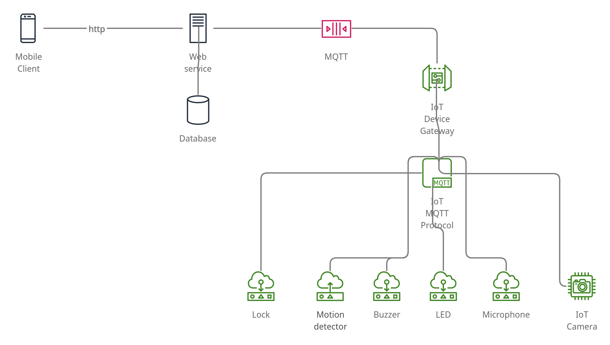

# mciot_home_security

## [IoT initial story draft ](https://gitlab.cs.ut.ee/antikivi/mciot_home_security/-/blob/main/IoT_story_draft.md)

## [IoT story development and scenario](https://gitlab.cs.ut.ee/antikivi/mciot_home_security/-/blob/main/IoT_story.md)

##  [Video pitch link IoT Gang](https://youtu.be/Tgev7cA0Azw)

## General solution
Detailed layout of the solution

General solution was to include business logic in ws and make mobile app and iot gateway to communicate with it through mqtt or http, not directly. All sensors and actuators should communicate with IoT gateway using local mqtt.
Mqtt(external to iot) was chosen because it is easy to push messages to different parties and managing of messages is already taken care of. And IoT already used it locally.

## Team roles and Skills
* Mobile - android app- Vera
* IoT Devices- Gabriel Cmiel
* Web Services- Anti Kivi

## Project features implemented ,related challenges and future improvements with relation to implementation of: 
1. [IoT devices](https://gitlab.cs.ut.ee/antikivi/mciot_home_security/-/blob/main/iot_home/README.md)
2. [Web Services](https://gitlab.cs.ut.ee/antikivi/mciot_home_security/-/blob/main/homsec_service/README.md)
3. [Mobile application](https://gitlab.cs.ut.ee/antikivi/mciot_home_security/-/blob/main/mobile_app/README.md)

## Challenges faced as a team in general
* Device sharing
* Network related issues
* General individual related tasks as indicated in respective project readmes.

